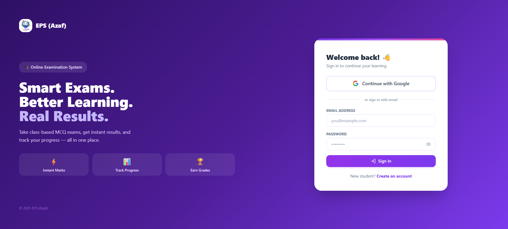
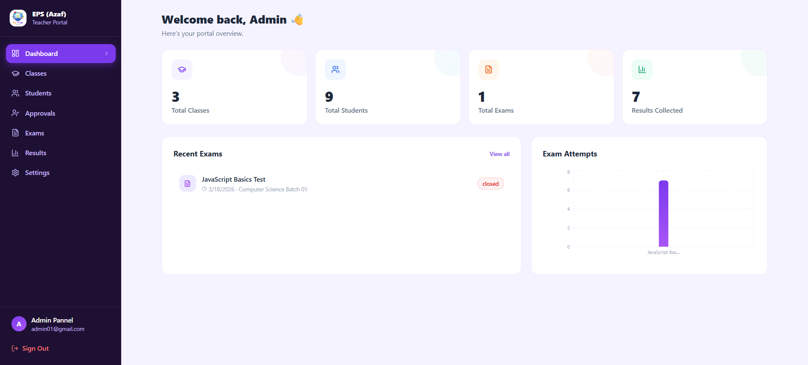
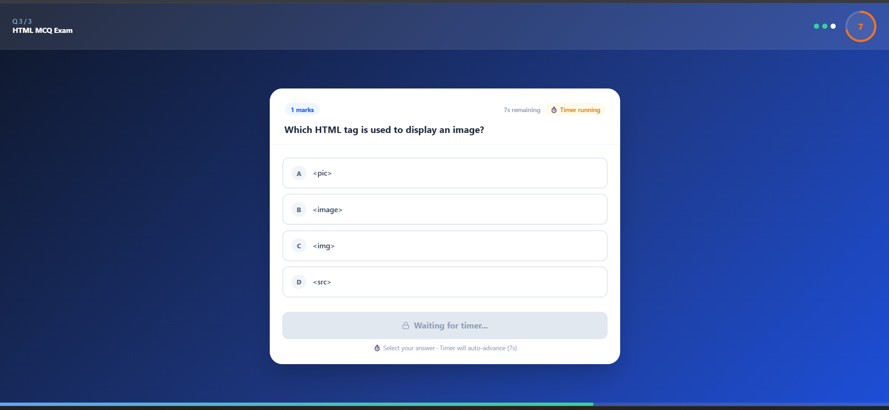
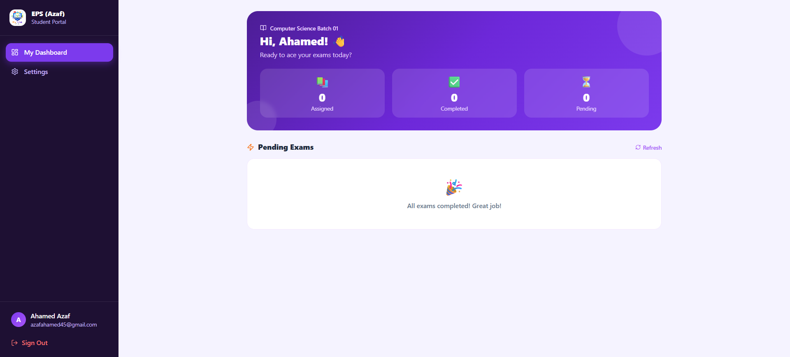

# 📚 Exame Portal — Next.js + MySQL + JWT

**Online Class-Based Examination Management System**

---

## 🗄️ Database Architecture

All application data is stored and managed in **MySQL**.

### Database Tables

| Table     | Purpose                                              |
|-----------|------------------------------------------------------|
| users     | Teachers & Students (passwords hashed with bcrypt)   |
| classes   | Class / Batch management                             |
| exams     | Exam records with status control                     |
| questions | MCQ questions with JSON options array                |
| results   | Student exam results with detailed answer breakdown  |

### Authentication

- **JWT Token** — A signed token is issued on login and sent as a Bearer token with every API request.
- **bcryptjs** — All passwords are securely hashed before storage.
- Token is saved in `localStorage` under the key `exame_token`.

---

## 🚀 Setup Instructions

Follow these steps in order to get the application running locally.

### Step 1 — Start Laragon
Open Laragon and click **Start All**. MySQL must be running before proceeding.

### Step 2 — Extract the ZIP
Extract the project ZIP file and open the folder.

### Step 3 — Configure Environment Variables
Open `.env.local` and update if necessary:
```
DB_HOST=localhost
DB_PORT=3306
DB_USER=root
DB_PASSWORD=          ← Leave empty for Laragon default
DB_NAME=exame_portal
JWT_SECRET=exame_portal_super_secret_jwt_key_2025
```

### Step 4 — Install Dependencies
```bash
npm install
```

### Step 5 — Initialise the Database
```bash
node scripts/init-db.js
```
This script will:
- Create the `exame_portal` database
- Create all required tables
- Insert demo data (teacher account, 2 student accounts, sample exams)

### Step 6 — Run Database Migrations (first time only)
```bash
node scripts/add-google-column.js
node scripts/add-approval-system.js
node scripts/add-portal-settings.js
```

### Step 7 — Start the Development Server
```bash
npm run dev
```

### Step 8 — Open in Browser
```
http://localhost:3000
```

---

## 🔑 Default Login Credentials

| Role    | Email               | Password   |
|---------|---------------------|------------|
| Teacher | teacher@exame.com   | teacher123 |
| Student | arun@student.com    | student123 |
| Student | priya@student.com   | student123 |

> **Note:** Change the teacher password after the first login for security.

---

## 🏗️ Project Structure

```
exame-portal/
├── .env.local                  ← Database & JWT configuration
├── scripts/
│   ├── init-db.js              ← Database initialisation script
│   ├── add-google-column.js    ← Migration: Google OAuth columns
│   ├── add-approval-system.js  ← Migration: Student approval columns
│   ├── add-portal-settings.js  ← Migration: Portal settings table
│   └── fix-admin.js            ← Reset admin password utility
├── src/
│   ├── lib/
│   │   ├── db.js               ← MySQL connection pool
│   │   ├── jwt.js              ← JWT sign & verify
│   │   ├── apiHelpers.js       ← API response helper functions
│   │   └── api.js              ← Frontend API client
│   ├── context/
│   │   ├── AuthContext.js      ← JWT-based authentication state
│   │   └── PortalContext.js    ← Portal branding global state
│   ├── components/
│   │   ├── Providers.js        ← Session + Portal + Auth providers
│   │   ├── SettingsPage.js     ← Shared account settings component
│   │   └── PortalLogo.js       ← Reusable logo component
│   └── app/
│       ├── api/                ← Backend API route handlers
│       │   ├── auth/           ← login, register, me, NextAuth
│       │   ├── classes/        ← CRUD operations
│       │   ├── students/       ← List, update, approval check
│       │   ├── exams/          ← CRUD operations
│       │   ├── questions/      ← CRUD operations
│       │   ├── results/        ← Submit & list results
│       │   ├── dashboard/      ← Statistics & chart data
│       │   ├── settings/       ← Account settings
│       │   ├── portal/         ← Portal branding settings
│       │   └── notifications/  ← Teacher notification queue
│       ├── teacher/            ← Teacher portal pages
│       │   ├── dashboard/
│       │   ├── classes/
│       │   ├── students/
│       │   ├── approvals/
│       │   ├── exams/
│       │   ├── results/
│       │   └── settings/
│       └── student/            ← Student portal pages
│           ├── dashboard/
│           ├── exam/[id]/
│           └── settings/
```

---

## 🔌 API Endpoints

| Method | Endpoint                      | Auth    | Description                        |
|--------|-------------------------------|---------|------------------------------------|
| POST   | /api/auth/login               | Public  | Login and receive JWT token        |
| POST   | /api/auth/register            | Public  | Student self-registration          |
| GET    | /api/auth/me                  | JWT     | Verify token and return user info  |
| GET    | /api/classes                  | JWT     | List all classes                   |
| POST   | /api/classes                  | Teacher | Create a new class                 |
| PUT    | /api/classes/:id              | Teacher | Update class details               |
| DELETE | /api/classes/:id              | Teacher | Delete a class                     |
| GET    | /api/students                 | Teacher | List all students                  |
| PUT    | /api/students/:id             | Teacher | Update student status or class     |
| GET    | /api/students/check-approval  | JWT     | Check real-time approval status    |
| GET    | /api/exams                    | JWT     | List exams (filtered by role)      |
| POST   | /api/exams                    | Teacher | Create a new exam                  |
| PUT    | /api/exams/:id                | Teacher | Update exam details                |
| DELETE | /api/exams/:id                | Teacher | Delete an exam                     |
| GET    | /api/questions                | JWT     | List questions for an exam         |
| POST   | /api/questions                | Teacher | Add a question to an exam          |
| PUT    | /api/questions/:id            | Teacher | Update a question                  |
| DELETE | /api/questions/:id            | Teacher | Delete a question                  |
| GET    | /api/results                  | JWT     | List results (filtered by role)    |
| POST   | /api/results                  | Student | Submit a completed exam            |
| GET    | /api/dashboard                | Teacher | Dashboard statistics & chart data  |
| GET    | /api/settings                 | JWT     | Get current user profile           |
| PUT    | /api/settings                 | JWT     | Update name, email, or password    |
| GET    | /api/portal                   | Public  | Get portal branding settings       |
| PUT    | /api/portal                   | Teacher | Update portal name, logo, tagline  |
| GET    | /api/notifications            | Teacher | List teacher notifications         |
| PUT    | /api/notifications            | Teacher | Mark all notifications as read     |

---

## 🔒 Security Features

| Feature                  | Implementation                                              |
|--------------------------|-------------------------------------------------------------|
| Password Hashing         | bcryptjs with cost factor 10                                |
| Authentication           | JWT (jsonwebtoken) with server-side secret                  |
| Google OAuth             | NextAuth v4 with Google Provider                            |
| Disposable Email Block   | 40+ fake/temporary email domains rejected at registration   |
| Anti-Cheat Exam Engine   | Timer lock, tab-switch detection, fullscreen enforcement    |
| Role-Based Access        | Every API route validates JWT role claims server-side       |
| Student Approval Gate    | No login access until teacher explicitly approves account   |
| SQL Injection Prevention | All queries use mysql2 parameterised statements             |

---

## 👥 User Roles & Permissions

| Feature                           | Teacher | Student           |
|-----------------------------------|---------|-------------------|
| Dashboard with analytics          | ✅      | ✅ Personal only  |
| Class management                  | ✅      | —                 |
| Student management & approval     | ✅      | —                 |
| Exam creation & management        | ✅      | —                 |
| Question management               | ✅      | —                 |
| Take MCQ exams                    | —       | ✅                |
| View own results                  | —       | ✅                |
| Export results (CSV / XLSX / PDF) | ✅      | —                 |
| Portal branding settings          | ✅      | —                 |
| Change display name               | ✅      | ✅                |
| Change password                   | ✅      | ✅                |
| Change email address              | ✅      | —                 |
| Google OAuth login                | ✅      | ✅ After approval |

---

## 🛠️ Tech Stack

| Layer          | Technology                       |
|----------------|----------------------------------|
| Framework      | Next.js 14 (App Router)          |
| UI Library     | React 18                         |
| Styling        | Tailwind CSS                     |
| Database       | MySQL 8.0                        |
| DB Client      | mysql2/promise                   |
| Authentication | JWT (jsonwebtoken) + NextAuth v4 |
| Password Hash  | bcryptjs                         |
| Charts         | Recharts                         |
| Excel Export   | ExcelJS                          |
| PDF Export     | jsPDF + jspdf-autotable          |
| Icons          | Lucide React                     |
| Dev Server     | Laragon (local)                  |

---

## 📋 Environment Variables Reference

| Variable             | Description                             | Example                         |
|----------------------|-----------------------------------------|---------------------------------|
| DB_HOST              | MySQL host address                      | localhost                       |
| DB_PORT              | MySQL port                              | 3306                            |
| DB_USER              | MySQL username                          | root                            |
| DB_PASSWORD          | MySQL password (empty for Laragon)      |                                 |
| DB_NAME              | Database name                           | exame_portal                    |
| JWT_SECRET           | Secret key for signing JWT tokens       | your_secret_key_here            |
| NEXTAUTH_SECRET      | Secret key for NextAuth sessions        | your_nextauth_secret_here       |
| NEXTAUTH_URL         | Application base URL                    | http://localhost:3000           |
| GOOGLE_CLIENT_ID     | Google OAuth 2.0 Client ID              | xxxx.apps.googleusercontent.com |
| GOOGLE_CLIENT_SECRET | Google OAuth 2.0 Client Secret          | GOCSPX-xxxxxxxxxxxx             |
| NEXT_PUBLIC_APP_URL  | Public app URL (used in client code)    | http://localhost:3000           |

---

## ❓ Troubleshooting

**"Access denied for user 'root'"**
Your Laragon MySQL has a password set.
→ Add `DB_PASSWORD=yourpassword` to `.env.local`.

**"Database connection refused"**
MySQL is not running.
→ Open Laragon and click **Start All**.

**"Tables already exist" warning**
This is not an error — the script skips existing tables safely.
→ To reset completely: drop `exame_portal` in phpMyAdmin and re-run `init-db.js`.

**Login loop / token expired**
The stored JWT token may be invalid or stale.
→ Open DevTools → Application → Local Storage → delete `exame_token` → refresh.

**Google login shows "invalid_client"**
Google OAuth credentials are missing or incorrect.
→ Check `GOOGLE_CLIENT_ID` and `GOOGLE_CLIENT_SECRET` in `.env.local`.
→ Refer to `GOOGLE_OAUTH_SETUP.md` for the full step-by-step setup guide.

**Cannot log in after changing password**
The new token was not saved correctly after the password change.
→ Run `node scripts/fix-admin.js` to reset the admin password to `admin123`.

---

## 📸 Screenshots

### Login Page


### Teacher Dashboard


### Exam Management


### Student Dashboard


*Exame Portal v1.0.0 — Built with Next.js 14 · MySQL · JWT · Google OAuth*
